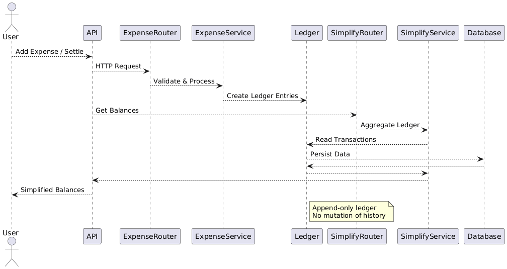

# Expense Sharing Application (Splitwise-like Backend)

## Overview
This project is a backend system for an expense sharing application, similar to Splitwise.  
It allows users to create shared expenses within a group, track balances, and settle dues efficiently.  
The focus of this assignment is **engineering design, scalability, and clarity of thought** rather than UI.

## Features Implemented

- Add shared expenses within a group
- Supported split types:
  - ✅ Equal split
  - ✅ Exact amount split
  - ✅ Percentage split
- Track balances:
  - Who owes whom
  - How much each user owes
  - How much others owe a user
- Balance simplification (net dues)
- Settlement handling (payments)
- Clean, modular, scalable backend architecture

## Core Design Idea (Most Important)

### Ledger-Based Architecture
Instead of directly storing balances, the system uses an **append-only ledger model**.  
Each transaction records:

- `from_user` → who owes money
- `to_user` → who is owed money
- `amount`
- `group_id`

This design ensures:

- ✅ Financial correctness
- ✅ Auditability
- ✅ Easy settlement handling
- ✅ Scalability as transactions grow

No historical data is ever modified or deleted.  
All changes (including settlements) are recorded as new ledger entries.

## High-Level Flow

1. A user adds an expense
2. The system:
   - Calculates individual shares
   - Creates ledger entries for each debtor
3. Multiple expenses accumulate in the ledger
4. A balance simplification algorithm computes net dues
5. Settlements are recorded as reverse ledger entries
6. Final balances are recalculated dynamically

## Tech Stack

- **Language**: Python 3
- **Framework**: FastAPI
- **Database**: SQLite (for simplicity and portability)
- **ORM**: SQLAlchemy
- **API Docs**: Swagger UI (auto-generated)

SQLite was chosen to ensure the project runs out-of-the-box without external DB setup.  
The architecture allows easy migration to PostgreSQL/MySQL.

## Architecture 
[](architecture.png)

## Project Structure
```code
expense_sharing_app/
├── app/
│   ├── main.py                  # Application entry point
│   ├── database.py              # DB setup and session handling
│   ├── models/
│   │   └── ledger.py            # Ledger data model
│   ├── schemas/
│   │   ├── expense.py           # Expense request schemas
│   │   └── settlement.py        # Settlement request schema
│   ├── services/
│   │   ├── expense_service.py
│   │   ├── simplify_service.py
│   │   └── settlement_service.py
│   └── routers/
│       └── expenses.py          # API routes
├── test_scripts.json            # All test requests (single file)
├── requirements.txt
└── expense.db                   # SQLite DB (auto-created)
```

## How to Run the Application

1. Install dependencies

```bash
pip install -r requirements.txt
```
2. Start the server

```bash
uvicorn app.main:app --reload
```

3.Open Swagger UI
```
http://127.0.0.1:8000/docs
```
## How to Test the Application
Single Test File for All Requests

All test inputs are provided in one file:
test_scripts.json

This file contains:

- Equal split expense
- Exact split expense
- Percentage split expense
- Settlement request

### Testing Steps:

Open test_scripts.json, Copy the required JSON block and Paste it into Swagger UI

Execute the request and Observe the response

This approach makes testing simple, reproducible, and reviewer-friendly.
Example Test Flow

Add multiple expenses using different split types

Call:
```
GET /groups/{group_id}/simplify
```
to Observe simplified balances

Perform a settlement
```
POST /groups/{group_id}/settle
```
Call simplify again to see updated balances

## Balance Simplification Logic

- All ledger entries are aggregated
- Net balance per user is calculated
- Only the minimum required payments are returned

This avoids redundant transactions and reflects real-world settlements.


## Settlement Handling (Important Design Choice)
Settlements are handled by:

- Adding a reverse ledger entry
- NOT modifying or deleting existing records

Example:

User A owes User B ₹500

Settlement: User A pays ₹200

→ Ledger entry: User B → User A ₹200

This keeps the ledger:
- Append-only
- Auditable
- Correct

## Why This Approach Stands Out

- Uses an industry-style ledger model
- Avoids direct balance mutation
- Supports extensibility (new split types, DBs, APIs)
- Clean separation of concerns (router, service, model)
- Designed for correctness, not shortcuts
- Testable via a single JSON file

This is closer to how real financial systems are designed.

## Possible Enhancements

- User & group management APIs
- Authentication & authorization
- Currency support
- Frontend UI
- Database migration to PostgreSQL
- Performance optimizations for large groups

## Conclusion
This project demonstrates a scalable, clean, and well-thought-out backend design for expense sharing, focusing on correctness, extensibility, and clarity — exactly what a production-ready system requires.